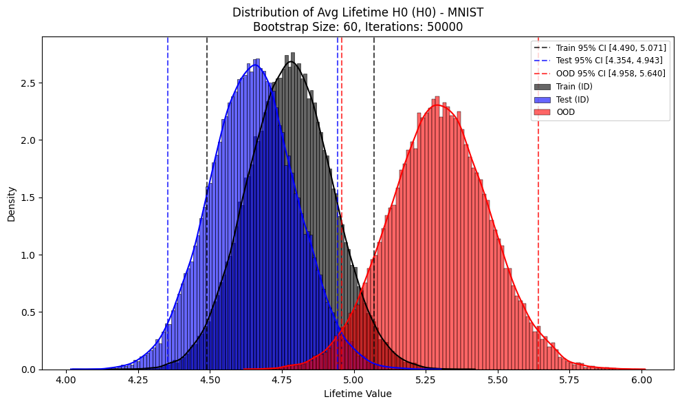
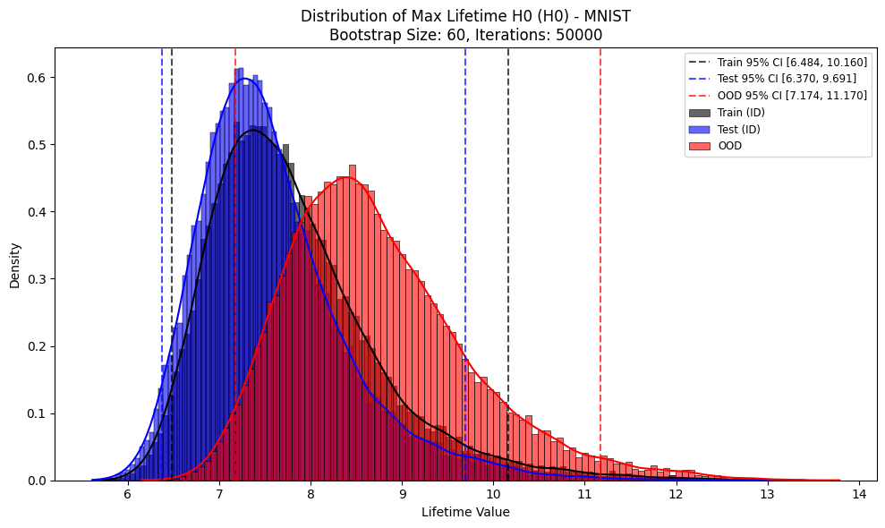

# Topology of Out-of-Distribution Examples in Deep Neural Networks

**Paper:** [arXiv:2501.12522](https://arxiv.org/abs/2501.12522)
---

## Key Contributions & Findings

* **Novel Application:** Leverages topological properties of latent layer embeddings (specifically persistent homology) to characterize OOD examples across multiple benchmark datasets (MNIST/EMNIST, CIFAR-10/CIFAR-100, CIFAR-10/SVHN).
* **Extended Validation:** Demonstrates that the "topological simplification" phenomenon observed in prior work extends beyond training data to test datasets, multi-class problems, and more realistic architectures (ResNet18) and datasets.
* **Computational Feasibility:** Shows that a TDA pipeline using persistent homology is computationally feasible for analyzing realistic DNNs at scale, using modern tools like Ripser and bootstrapping techniques.
* **Core Insight:** The primary finding is that while well-trained DNNs simplify the topology (reduce persistence of features) of in-distribution (ID) data (both train and test), they **fail to do so for OOD data**.
* **OOD Indicator:** The **average lifetime** of $H_0$ features (connected components) in the latent space is statistically significantly longer for OOD examples compared to ID examples. This provides a quantitative topological marker for OOD detection.

---

## Methodology Overview

1.  **Model Architecture:** ResNet18, adapted for the specific input (grayscale for MNIST, RGB for CIFAR-10) and output classes.
2.  **Datasets:**
    * ID: MNIST (Train/Test), CIFAR-10 (Train/Test)
    * OOD: EMNIST (Letters, Test), CIFAR-100 (Test), SVHN (Test)
3.  **Embedding Extraction:** Features are extracted from the penultimate layer (output of the global average pooling layer) of the ResNet18.
4.  **Topological Data Analysis (TDA):**
    * **Persistent Homology (PH):** Calculated using the Vietoris-Rips complex construction on the extracted embeddings. Focuses on $H_0$ (connected components) and $H_1$ (loops/holes).
    * **Bootstrapping:** To handle large datasets and provide statistical robustness, the analysis relies on bootstrapping:
        * Repeatedly draw random subsamples (e.g., size 50, 100, 150) with replacement from the full set of embeddings for ID-Train, ID-Test, and OOD data.
        * Compute PH for each subsample using `ripser`.
        * Calculate summary statistics: **Average Lifetime** and **Maximum Lifetime** for $H_0$ and $H_1$ features.
5.  **Comparison:** Distributions of the calculated lifetime statistics are plotted and compared across ID-Train, ID-Test, and OOD data, including 95% confidence intervals derived from the bootstrap iterations.

---

## Potential Applications

The findings suggest that the average lifetime of low-dimensional topological features ($H_0$) in latent space could serve as a signal for OOD detection systems, complementing existing methods. It provides a way to quantify model uncertainty based on the geometric structure of its internal representations.

---

## Code & Replication


Python Notebook to repkicate the paper results (using PyTorch, torchvision, ripser.py, matplotlib, numpy) can be used to replicate the core analysis. This involves:
* Loading models and datasets.
* Extracting embeddings via hooks.
* Implementing the bootstrap loop with `ripser` calls.
* Plotting the resulting lifetime distributions.

*(Note: Achieving results identical to the paper may require matching the exact training procedure, hyperparameters, and potentially using GPU acceleration for large bootstrap iteration counts.)*

---
## Topological Analysis Results for MNIST (H0 Lifetimes)

Here are the distributions of the average and maximum lifetimes for the 0th homology group (H0, representing connected components) calculated from bootstrapped subsamples of MNIST embeddings.

**Average H0 Lifetime Distribution:**


*Caption: This plot shows the distribution of the average lifetime of H0 features across different subsamples for In-Distribution (Train/Test) and Out-of-Distribution MNIST-like data.*

**Maximum H0 Lifetime Distribution:**


*Caption: This plot shows the distribution of the maximum lifetime of H0 features across different subsamples for In-Distribution (Train/Test) and Out-of-Distribution MNIST-like data.*

---

---
## Citation

**BibTeX:**
```bibtex
@misc{datta2025topology,
      title={Topology of Out-of-Distribution Examples in Deep Neural Networks},
      author={Esha Datta and Johanna Hennig and Eva Domschot and Connor Mattes and Michael R. Smith},
      year={2025},
      eprint={2501.12522},
      archivePrefix={arXiv},
      primaryClass={cs.LG},
      url={[https://arxiv.org/abs/2501.12522](https://arxiv.org/abs/2501.12522)}
}
```